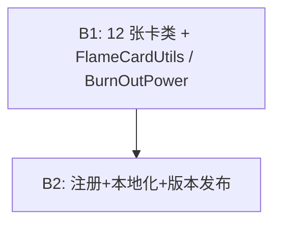

# KianaMod（琪亚娜，出击！）火焰形态扩展 · 架构设计与任务分解说明书

> 角色：架构师 高见远（software-architect-2）
> 模块：薪炎之律者（火焰形态）卡池扩展 —— 新增 12 张卡牌
> 目标版本：v1.0.0 → **v1.1.0**
> 范围：**仅设计与分解，不编写 12 张卡的具体 Java 业务代码**
> 说明：本文在既有草稿基础上核对了 team-lead 的精确规格，修正了资源目录命名、IMG 参数、崩坏能获取量升级约定，并补充了燃尽(BurnOut) 的回合开始序列图。

---

## 一、实现方案（Implementation Approach）

### 1.1 技术难点
1. **一致性**：12 张卡必须严格沿用现有工程的 `makeID` / `CustomCard` / `BaseMod.addCard` / `loadCustomStrings` 模式，ID、本地化键、注册三者一一对应，避免错配。
2. **崩坏能读写**：多张卡需“读取当前崩坏能层数”（薪火相传、天火出鞘阈值、炎龙破消耗）以及“获得/削减崩坏能”，写法需统一封装，避免散落 `p.getPower(...).amount` 判空。
3. **形态判定**：炎之追击 / 守护之焰需判断“是否处于薪炎之律者”，必须用 `stance instanceof FlameStance`。
4. **边缘状态**：灰烬重燃（消耗+抽牌）、余烬（保留）、炎龙破（消耗全部崩坏能并循环加伤）、燃尽（每回合自伤+获得崩坏能）属于非常规流程，需明确实现手法（见第七、十节）。
5. **零新增 Power（唯一例外）**：设计约束是复用既有 `HonkaiEnergy / BurnPower / ProtectionPower / EternalBlazingFlamePower`。仅 **燃尽(BurnOut)** 因“每回合开始获得崩坏能”需要回合开始钩子，存在 **1 个新增 Power 类**的例外风险（见第七节）。

### 1.2 框架与库选择（沿用，无新增）
| 项 | 选型 | 说明 |
|---|---|---|
| 游戏基座 | Slay the Spire（com.megacrit.cardcrawl.*） | 提供 Card / Power / Action / Stance |
| Mod 框架 | **BaseMod**（basemod.abstracts.CustomCard 等） | 卡牌/字符串注册 API |
| 加载器 | **ModTheSpire** | 版本声明在 `ModTheSpire.json` |
| 语言 | **Java 8**（与 STS/ModTheSpire 兼容） | 不引入 Kotlin/Gradle 等 |
| 新增第三方库 | **无** | 全部复用既有类 |

### 1.3 架构模式
- **每张卡 = 一个自包含 `CustomCard` 子类**，状态（damage / magicNumber / block）由基类持有，`use()` 内用 Action 组合既有 Power。
- **组合优于继承**：不新增卡牌基类；通过一个**可选**的轻量工具类 `kianamod.util.FlameCardUtils` 收敛崩坏能读写与形态判定，降低 12 张卡间的重复代码（可不加，仅建议）。
- **注册与数据分离**：卡逻辑（Java）与展示文案（cards.json）解耦，靠 `makeID` 字符串键桥接。

---

## 二、文件清单（File List）

### 2.1 新建文件（12 张卡，位于 `kianamod/card/`）
工程根：`E:\项目改变\KianaMod-m3\`
> 标准 Gradle 源码布局下完整路径为 `src/main/java/kianamod/card/<ClassName>.java`；若工程使用其他源码根，以 team-lead 所述“保持 `kianamod/card/` 包结构”为准，包名必须为 `kianamod.card`。

| 文件（包相对路径 `kianamod/card/`） | 类名 | 说明 |
|---|---|---|
| `FlamePursuit.java` | `FlamePursuit` | 炎之追击 |
| `CrimsonCharge.java` | `CrimsonCharge` | 赤焰冲锋 |
| `PassFlame.java` | `PassFlame` | 薪火相传 |
| `SkyfireDraw.java` | `SkyfireDraw` | 天火出鞘 |
| `EmberRekindle.java` | `EmberRekindle` | 灰烬重燃 |
| `BurnOut.java` | `BurnOut` | 燃尽 |
| `ValkyrieOath.java` | `ValkyrieOath` | 女武神的誓言 |
| `FlameStorm.java` | `FlameStorm` | 烈焰风暴 |
| `Cinder.java` | `Cinder` | 余烬 |
| `PrairieFire.java` | `PrairieFire` | 燎原 |
| `FlameDragonBreak.java` | `FlameDragonBreak` | 炎龙破 |
| `GuardianFlame.java` | `GuardianFlame` | 守护之焰 |

> 可选新建：`kianamod/util/FlameCardUtils.java`（崩坏能读写 + 形态判定封装，见第五节）。
> 条件新建：`kianamod/powers/BurnOutPower.java`（燃尽回合开始钩子，仅当采用第七节方案 A 时新增）。

### 2.2 修改文件
| 文件 | 修改点 |
|---|---|
| `kianamod/modcore/ExampleMod.java` | `receiveEditCards()` 内新增 12 次 `BaseMod.addCard(new X())` |
| `<资源目录>/localization/ZHS/cards.json` | 新增 12 条 `{"ExampleMod:<ClassName>": {"NAME":..., "DESCRIPTION":...}}` |
| `ModTheSpire.json` | `"version"` 由 `1.0.0` 升到 `1.1.0` |

> ⚠️ **资源目录命名待确认（见第七节 #1）**：team-lead 的逆向上下文写的是 `ExampleModResources/localization/ZHS/cards.json`，但交付物清单写的是 `ExampleResources/localization/ZHS/cards.json`（少了 “Mod”）。两者不一致，需向作者/工程实际目录确认后二选一。下表与全文以 **`ExampleModResources`** 为默认假设（与逆向上下文一致），但工程师必须核对真实目录名。
>
> `receiveEditStrings()` 中 `BaseMod.loadCustomStrings(CardStrings.class, cards.json)` 通常按命名空间一次性加载整份 JSON，**新增 JSON 条目后无需改动 Java**；仅当现有代码未覆盖 ZHS 时才需补充加载调用。

---

## 三、数据结构与接口（classDiagram）

> 完整图见 [`class-diagram.mermaid`](./class-diagram.mermaid)

**关键约定（UML 对应的代码骨架）：**

- 12 张卡均 `--|>` 继承 `basemod.abstracts.CustomCard`。
- 基类已持有 `baseDamage / damage / baseMagicNumber / magicNumber / baseBlock / block / cost / exhaust / retain`。
- 另建议为“崩坏能获取量”增设实例字段 `int honkaiGain`（详见第五节 5.8），用于 Cinder 等会随升级变化的卡。
- 工具类 `FlameCardUtils`（可选）提供：`getHonkai(c)`、`addHonkai(c,n)`、`reduceHonkai(c,n)`、`isFlameStance(p)`。
- 复用的既有 Power/Action 作为依赖（`..>`）标注：HonkaiEnergy、BurnPower、ProtectionPower、EternalBlazingFlamePower、VulnerablePower（原版）、FlameStance、DamageAction、DamageAllEnemiesAction、GainBlockAction、DrawCardAction、ReducePowerAction。

每张卡的最小接口签名（设计级，非实现）：
```java
public class FlamePursuit extends CustomCard {
    public static final String ID = ExampleMod.makeID("FlamePursuit");
    private int honkaiGain = 1;                 // 崩坏能获取量（常量卡也可直接字面量）
    public FlamePursuit() {
        super(ID, NAME, IMG, COST, DESCRIPTION, TYPE, COLOR, RARITY, TARGET);
        this.baseDamage = 8;
        this.baseMagicNumber = this.magicNumber = 2;   // 易伤层数
    }
    @Override public void use(AbstractPlayer p, AbstractMonster m) { /* 见复用清单 */ }
    @Override public void upgrade() { if (!upgraded) { upgradeName(); upgradeDamage(3); upgradeMagicNumber(1); } }
}
```

---

## 四、程序调用流（sequenceDiagram）

> 完整图见 [`sequence-diagram.mermaid`](./sequence-diagram.mermaid)，含 5 个序列：
> 1. 启动期 `receiveEditCards` + `receiveEditStrings` 注册流程
> 2. 典型攻击卡 `use()`（炎之追击：形态判定→伤害→获得崩坏能）
> 3. 消耗崩坏能循环（炎龙破：读层数→按点循环加伤→一次性削减）
> 4. 群体伤害 + 崩坏能阈值（天火出鞘：`honkai>=5` 分支 + `DamageAllEnemiesAction`）
> 5. 燃尽(BurnOut) 回合开始钩子（自伤 + 每回合获得崩坏能，方案 A）

核心不变量：**所有效果都通过 `AbstractDungeon.actionManager.addToBottom(...)` 入队**，保证与游戏行动队列顺序一致；崩坏能的“获得/削减”永远走 `ApplyPowerAction` / `ReducePowerAction` 包 `HonkaiEnergy`。

---

## 五、共享约定（跨文件，工程师必读）

### 5.1 统一 import 列表（每张卡文件头部）
```java
package kianamod.card;

import basemod.abstracts.CustomCard;
import com.megacrit.cardcrawl.actions.AbstractGameAction;
import com.megacrit.cardcrawl.actions.common.*;        // DamageAction, DamageAllEnemiesAction,
                                                        // GainBlockAction, DrawCardAction,
                                                        // ApplyPowerAction, ReducePowerAction
import com.megacrit.cardcrawl.cards.AbstractCard;
import com.megacrit.cardcrawl.cards.DamageInfo;
import com.megacrit.cardcrawl.characters.AbstractPlayer;
import com.megacrit.cardcrawl.core.AbstractCreature;
import com.megacrit.cardcrawl.dungeons.AbstractDungeon;
import com.megacrit.cardcrawl.monsters.AbstractMonster;
import com.megacrit.cardcrawl.powers.VulnerablePower;   // 易伤（原版）
import kianamod.characters.MyCharacter;                // 取 PlayerColorEnum
import kianamod.modcore.ExampleMod;
import kianamod.powers.*;                              // HonkaiEnergy, BurnPower,
                                                        // ProtectionPower, EternalBlazingFlamePower
import kianamod.stances.FlameStance;
```

### 5.2 super 构造签名（统一）
```java
super(ID, NAME, IMG, COST, DESCRIPTION, TYPE, COLOR, RARITY, TARGET);
```
| 参数 | 取值规则 |
|---|---|
| `ID` | `ExampleMod.makeID("<ClassName>")` → 字符串 `"ExampleMod:<ClassName>"` |
| `NAME` | `cardStrings.NAME`（来自 JSON） |
| `IMG` | **沿用现有卡的通用底图 STRING**（从任意现有 `kianamod/card/*.java` 的 super 调用中复制同一字面量；team-lead 明确“STRING 路径传入 super 的 IMG 参数”，新卡无需新图，故不要传 `null`，应与现有卡保持一致） |
| `COST` | 卡面费用（0/1/2） |
| `DESCRIPTION` | `cardStrings.DESCRIPTION`（来自 JSON，支持 `!D!` `!B!` `!M!` 占位符） |
| `TYPE` | `CardType.ATTACK` / `SKILL` / `POWER` |
| `COLOR` | `MyCharacter.Enums.PlayerColorEnum`（团队逆向记为 `MyCharacter$PlayerColorEnum`，以工程实际枚举路径/常量名为准） |
| `RARITY` | `CardRarity.UNCOMMON` / `RARE`（强度高，建议非 COMMON，见第十节） |
| `TARGET` | `CardTarget.ENEMY` / `ALL_ENEMY` / `SELF` |

### 5.3 构造函数内字符串加载（统一模板）
```java
public static final String ID = ExampleMod.makeID("FlamePursuit");
private static final CardStrings CARD_STRINGS = CardCrawlGame.languagePack.getCardStrings(ID);
private static final String NAME = CARD_STRINGS.NAME;
private static final String DESCRIPTION = CARD_STRINGS.DESCRIPTION;
// IMG 为通用底图字面量，建议也提为常量： private static final String IMG = "<通用底图路径>";
```

### 5.4 崩坏能读写封装（建议下沉到 `FlameCardUtils`）
```java
// 读：当前崩坏能层数（安全判空）
public static int getHonkai(AbstractCreature c) {
    return c.hasPower(HonkaiEnergy.POWER_ID) ? c.getPower(HonkaiEnergy.POWER_ID).amount : 0;
}
// 获得 n 点崩坏能（入队）
public static void addHonkai(AbstractCreature c, int n) {
    AbstractDungeon.actionManager.addToBottom(
        new ApplyPowerAction(c, c, new HonkaiEnergy(c, n), n));
}
// 削减 n 点崩坏能（入队）
public static void reduceHonkai(AbstractCreature c, int n) {
    AbstractDungeon.actionManager.addToBottom(
        new ReducePowerAction(c, c, HonkaiEnergy.POWER_ID, n));
}
```

### 5.5 形态判定（薪炎之律者）
```java
// 在 use(p, m) 内
if (p.stance instanceof kianamod.stances.FlameStance) {
    // 处于薪炎之律者 → 触发额外效果
}
```
> 也可用 `AbstractDungeon.player.stance instanceof FlameStance`（team-lead 原文形式），但 `use` 已持 `p`，优先用 `p.stance`。两者等价。

### 5.6 边缘状态写法
| 状态 | 写法（构造函数内） |
|---|---|
| 消耗（Exhaust） | `this.exhaust = true;` |
| 保留（Retain） | `this.retain = true;` |
| 多段伤害 | `for (int i = 0; i < times; i++) addToBottom(new DamageAction(...));` |
| 群体伤害 | `addToBottom(new DamageAllEnemiesAction(p, dmgArray, DamageInfo.DamageType.FIRE, false));` 其中 `dmgArray` 为长度=敌人数量的 `int[]` |
| 群体上灼烧 | 遍历 `AbstractDungeon.getMonsters().monsters`，对每个存活敌人 `addToBottom(new ApplyPowerAction(m, m, new BurnPower(m, n), n));` |

### 5.7 upgrade() 规范
`upgrade()` 内先 `if (!upgraded) { upgradeName(); ... }`，再按本卡升级增量调用 `upgradeDamage(n)` / `upgradeMagicNumber(n)` / `upgradeBlock(n)`。括号内数值 = 升级后增量（见第十节表格）。`magicNumber` 只能承载**一个**可变数值，请合理分配（见 5.8）。

### 5.8 崩坏能获取量（`honkaiGain`）约定 ⭐ 新增
StS 基类只提供 `damage / block / magicNumber` 三个可变数值字段。本扩展中很多卡要“获得 N 点崩坏能”，该 N 多数恒定，但 **余烬(Cinder) 的获取量随升级变化（1→2）**。统一约定：

- 增设实例字段 `private int honkaiGain;`，构造函数中赋值（如 `this.honkaiGain = 1;`）。
- `use()` 中统一通过 `FlameCardUtils.addHonkai(p, this.honkaiGain);` 施加，便于集中与升级联动。
- 仅当该获取量需要随升级增长时（目前仅 Cinder），在 `upgrade()` 中 `this.honkaiGain += 1;`。
- 其余卡的 `honkaiGain` 为常量，升级时不动。

**描述中如何展示 `honkaiGain`**：StS 标准占位符只有 `!D!`(damage)、`!B!`(block)、`!M!`(magicNumber)，**没有 `!H!`**。处理方式：
- 若该卡“崩坏能获取量”是**唯一**可变数值（如 Cinder），直接复用 `magicNumber` 承载它，描述写 `获得 !M! 点崩坏能`，用 `upgradeMagicNumber(1)` 升级；此时 `magicNumber` 不再用于其他用途。
- 若该卡还有别的变量（伤害/易伤/庇护等已占用 `magicNumber`），则 `honkaiGain` 用字面量写进 DESCRIPTION（如 “获得 1 点崩坏能”），升级时描述不变（获取量恒定的卡本就不变；Cinder 属上一种情况）。

> 结论：Cinder 用 `magicNumber` + `!M!`；其余 11 张卡的崩坏能获取量用 `honkaiGain` 字段（含字面量描述），升级不变。

---

## 六、复用清单（每张卡对应既有 Power / Action）

| # | 卡 | 复用类 | 关键 action 写法 |
|---|---|---|---|
| 1 | 炎之追击 FlamePursuit | `DamageAction` + `ApplyPowerAction(HonkaiEnergy)` + `ApplyPowerAction(VulnerablePower)` + `FlameStance`(判定) | 单体 8(11) 火伤；若在薪炎之律者则给目标 2(3) 易伤（`magicNumber`）；获得 1 崩坏能（常量） |
| 2 | 赤焰冲锋 CrimsonCharge | `DamageAction`×times + `ApplyPowerAction(HonkaiEnergy)` | 6(8) 伤害 ×3(4) 次；获得 2 崩坏能（常量） |
| 3 | 薪火相传 PassFlame | `GainBlockAction` + `ApplyPowerAction(HonkaiEnergy)` | 格挡 = `getHonkai(p)` ×2(×3)；获得 1 崩坏能（常量） |
| 4 | 天火出鞘 SkyfireDraw | `DamageAllEnemiesAction` + `ApplyPowerAction(HonkaiEnergy)` | 全体 14(18)；若 `getHonkai(p)>=5` 改为 20(26)；获得 2 崩坏能（常量） |
| 5 | 灰烬重燃 EmberRekindle | `DrawCardAction` + `ApplyPowerAction(HonkaiEnergy)` | 抽 2(3)（`magicNumber`）；获得 2 崩坏能；`exhaust=true` |
| 6 | 燃尽 BurnOut ⚠️ | `BurnOutPower`(方案A) 或 `ApplyPowerAction(BurnPower, self)`(方案B) + 回合开始钩子 | 自身每回合开始受 3(4) 火焰伤害 并 +2 崩坏能（见第七节） |
| 7 | 女武神的誓言 ValkyrieOath | `ApplyPowerAction(EternalBlazingFlamePower)` | 获得 2(3) 层 永燃的薪火（`magicNumber`） |
| 8 | 烈焰风暴 FlameStorm | `DamageAllEnemiesAction`×times + `ApplyPowerAction(HonkaiEnergy)` | 全体 4(5) ×3(4) 次；获得 1 崩坏能（常量） |
| 9 | 余烬 Cinder | `ApplyPowerAction(HonkaiEnergy)` | 获得 1(2) 崩坏能（`magicNumber`/`honkaiGain` 升级）；`retain=true` |
| 10 | 燎原 PrairieFire | `ApplyPowerAction(BurnPower)`(全体) + `ApplyPowerAction(HonkaiEnergy)` | 全体敌人 3(4) 层灼烧（`magicNumber`）；获得 1 崩坏能（常量） |
| 11 | 炎龙破 FlameDragonBreak | `DamageAction` + `ReducePowerAction(HonkaiEnergy)` + 循环 | 16(21) 火伤；消耗全部崩坏能，每点 +2(3) 伤害（读 `getHonkai(p)` 后循环 `DamageAction`，末 `ReducePowerAction` 全削） |
| 12 | 守护之焰 GuardianFlame | `GainBlockAction` + `ApplyPowerAction(ProtectionPower)` + `FlameStance`(判定) | 8(11) 格挡 + 1(2) 庇护（`magicNumber`）；若在薪炎之律者额外 +4 格挡 |

> 易伤用原版 `com.megacrit.cardcrawl.powers.VulnerablePower`，非 kianamod 类。

---

## 七、待明确 / 风险（Anything UNCLEAR）

1. **⭐ 资源目录命名不一致（需最高优先确认）**
   team-lead 的逆向上下文写 `ExampleModResources/localization/ZHS/cards.json`，但交付物清单写 `ExampleResources/localization/ZHS/cards.json`（少了 “Mod”）。**二者必有一误**。工程师在动手前必须核对工程真实目录名，全文以 `ExampleModResources` 为默认假设。若实际为 `ExampleResources`，则所有出现该路径处同步替换。

2. **燃尽 BurnOut 的“每回合获得 2 崩坏能”需要回合开始钩子（最高实现风险）**
   `BurnPower` 作为“灼烧”通常是对敌的每回合火伤 debuff；把它 `ApplyPowerAction` 到自身可满足“每回合受 3(4) 火焰伤害”，但**它本身不会在回合开始给你崩坏能**。
   - **方案 A（推荐， fidelity 最高，需新增 1 个 Power 类）**：新增极小 `kianamod.powers.BurnOutPower extends AbstractPower`，在其回合开始钩子（推荐 `onEnergyRecharge()`，该钩子在玩家回合开始补充能量时触发，契合“每回合开始”）中顺序 `addToBottom(new ApplyPowerAction(p, p, new BurnPower(p, selfDmg), selfDmg))` + `FlameCardUtils.addHonkai(p, 2)`。BurnOut 卡在 `use()` 中 `addToBottom(new ApplyPowerAction(p, p, new BurnOutPower(p, amt), amt))`。这会与“不新增 Power”约束冲突，**需 team-lead 向作者确认是否可接受新增 1 个 Power**。
   - **方案 B（纯复用，降级效果）**：仅用 `BurnPower` 实现自伤部分，崩坏能增益改为**本卡打出时立即给**（一次性 2 点）而非每回合——强度略降但零新增。
   - **结论建议**：采用方案 A，并明确告知作者需要这 1 个新增 Power 类；其余 11 张严格零新增。

3. **灰烬重燃 消耗 + 抽牌**：`this.exhaust = true;` 在构造函数；抽牌用 `DrawCardAction(p, 2(3))` 入队即可，无歧义。

4. **炎龙破 消耗全部崩坏能的循环写法**：在 `use()` 中 `int n = FlameCardUtils.getHonkai(p);` 之后 `for (int i=0;i<n;i++) addToBottom(new DamageAction(p, m, new DamageInfo(p, +2(3), FIRE), AttackEffect.FIRE));` 最后 `FlameCardUtils.reduceHonkai(p, n);`。注意“消耗全部”意味着 `reduceHonkai` 用读到的 `n`（已被前面加伤前锁定），而非实时 `getHonkai`。若 `n==0` 则不进入循环、不削减，仅基础 16(21) 伤害。

5. **本地化 IMG 字段是否必填**：**JSON 中非必填**。Java 侧 `super` 的 `IMG` 参数按 5.2 传入通用底图 STRING（与现有卡一致），cards.json 中**省略 IMG 键**即可。新增 12 张建议全部省略 IMG。

6. **多段 / 群体伤害的 DamageType**：火焰主题统一 `DamageInfo.DamageType.FIRE`（若 `BurnPower`/火伤结算依赖该类型），否则用 `NORMAL`。建议统一 `FIRE` 以契合“火焰形态”。

7. **AoE 灼烧（燎原）遍历**：`for (AbstractMonster m : AbstractDungeon.getMonsters().monsters) if (!m.isDeadOrEscaped()) addToBottom(new ApplyPowerAction(m, m, new BurnPower(m, n), n));`

8. **稀有度 / 目标 / 费用**已在第十节表格给出推荐值，若作者有自定义平衡表以作者为准。

9. **颜色枚举常量名**：逆向记为 `MyCharacter$PlayerColorEnum`，实际常量名（如 `KIANA_COLOR`）需工程师对照 `MyCharacter.java` 确认后填入 5.2 的 `COLOR`。

---

## 八、任务分解列表（按实现顺序，标注依赖）

> 顺序依据团队要求：**先建 12 个卡类 → 再统一注册 → 再补本地化 → 最后改版本号**。

| 任务 | 名称 | 输入 | 产出 | 依赖 | 优先级 |
|---|---|---|---|---|---|
| **T1** | 实现 12 张火焰形态卡类（+可选 FlameCardUtils / 条件 BurnOutPower） | 本文档第五、六、十节规格 | `kianamod/card/` 下 12 个 `.java`（+ `util/FlameCardUtils.java` / `powers/BurnOutPower.java`） | 无（先确认第七节 #1 资源目录） | P0 |
| **T2** | 统一注册卡牌 | T1 产出的 12 个类 | `ExampleMod.java` 的 `receiveEditCards` 新增 12×`BaseMod.addCard(new X())` | T1 | P0 |
| **T3** | 补全本地化 | T1 的 ID/NAME/DESCRIPTION | `<资源目录>/localization/ZHS/cards.json` 新增 12 条（省略 IMG） | T1 | P1 |
| **T4** | 版本号与集成验证 | T2 + T3 | `ModTheSpire.json` 升 `1.1.0`；编译 + 进游戏冒烟（抽卡/出牌/形态切换/崩坏能结算正常） | T2, T3 | P1 |

> 说明：`receiveEditStrings` 一般按命名空间整体加载 cards.json，T3 完成后字符串自动生效，**T2 通常无需改动 `receiveEditStrings`**；仅当现有加载未覆盖 ZHS 才补调用。

---

## 九、构建任务卡（Bob 标准格式，≤5 任务，含依赖图）

为兼容“≤5 任务 / 每任务 ≥3 文件 / 首任务为基础”的构建计划约束，将第八节细粒度步骤归并为 **2 个构建任务**（T2/T3/T4 在既有 mod 中均为单文件编辑，强行拆 3 文件无意义，故合并为“注册·本地化·发布”）：

| 任务 | 名称 | 源文件（≥3） | 依赖 | 优先级 |
|---|---|---|---|---|
| **B1** | 火焰卡牌类 + 共享工具 | `kianamod/card/*.java` ×12（+可选 `kianamod/util/FlameCardUtils.java`、条件 `kianamod/powers/BurnOutPower.java`） | 无（先确认资源目录命名） | P0 |
| **B2** | 注册 · 本地化 · 版本发布 | `ExampleMod.java`、`cards.json`、`ModTheSpire.json` | B1 | P0/P1 |

### 9.1 任务依赖图


> 若团队希望保留第八节的 4 步粒度（更利于 code review 分步合并），依赖图为：
> ```mermaid
> graph TD
>     T1[ T1: 12 卡类 ] --> T2[ T2: 注册 ]
>     T1 --> T3[ T3: 本地化 ]
>     T2 --> T4[ T4: 版本+集成 ]
>     T3 --> T4
> ```

---

## 十、实现规格说明书要点总结（直接交工程师）

| # | 中文名 | 类 | 类型 | 费 | 基础效果 | 升级后 | 复用类 | 稀有度 | 目标 |
|---|---|---|---|---|---|---|---|---|---|
| 1 | 炎之追击 | `FlamePursuit` | ATTACK | 1 | 8 火伤；薪炎之律者时给 2 易伤；+1 崩坏能 | 11 伤 / 3 易伤 | DamageAction, VulnerablePower, HonkaiEnergy, FlameStance | UNCOMMON | ENEMY |
| 2 | 赤焰冲锋 | `CrimsonCharge` | ATTACK | 2 | 6 火伤 ×3 次；+2 崩坏能 | 8 伤 ×4 次 | DamageAction, HonkaiEnergy | UNCOMMON | ENEMY |
| 3 | 薪火相传 | `PassFlame` | SKILL | 1 | 格挡 = 崩坏能层数×2；+1 崩坏能 | ×3 | GainBlockAction, HonkaiEnergy | UNCOMMON | SELF |
| 4 | 天火出鞘 | `SkyfireDraw` | ATTACK | 2 | 全体 14 火伤；崩坏能≥5 时 20；+2 崩坏能 | 18 / 26 | DamageAllEnemiesAction, HonkaiEnergy | RARE | ALL_ENEMY |
| 5 | 灰烬重燃 | `EmberRekindle` | SKILL | 0 | 抽 2；+2 崩坏能；**消耗** | 抽 3 | DrawCardAction, HonkaiEnergy | UNCOMMON | SELF |
| 6 | 燃尽 | `BurnOut` | POWER | 1 | 每回合开始受 3 火伤 并 +2 崩坏能 ⚠️ | 4 火伤 | BurnOutPower(+钩子) 或 BurnPower | RARE | SELF |
| 7 | 女武神的誓言 | `ValkyrieOath` | POWER | 1 | +2 层永燃的薪火 | 3 层 | EternalBlazingFlamePower | RARE | SELF |
| 8 | 烈焰风暴 | `FlameStorm` | ATTACK | 1 | 全体 4 火伤 ×3 次；+1 崩坏能 | 5 伤 ×4 次 | DamageAllEnemiesAction, HonkaiEnergy | UNCOMMON | ALL_ENEMY |
| 9 | 余烬 | `Cinder` | SKILL | 0 | +1 崩坏能；**保留** | +2 崩坏能 | HonkaiEnergy | UNCOMMON | SELF |
| 10 | 燎原 | `PrairieFire` | SKILL | 1 | 全体敌人 +3 层灼烧；+1 崩坏能 | 4 层 | BurnPower, HonkaiEnergy | UNCOMMON | ALL_ENEMY |
| 11 | 炎龙破 | `FlameDragonBreak` | ATTACK | 2 | 16 火伤；消耗全部崩坏能，每点 +2 伤 | 21 伤 / +3 每点 | DamageAction, ReducePowerAction, HonkaiEnergy | RARE | ENEMY |
| 12 | 守护之焰 | `GuardianFlame` | SKILL | 1 | 8 格挡 +1 庇护；薪炎之律者时 +4 格挡 | 11 格挡 / 2 庇护 | GainBlockAction, ProtectionPower, FlameStance | UNCOMMON | SELF |

### 提交检查清单（工程师自测）
- [ ] 动工前确认资源目录是 `ExampleModResources` 还是 `ExampleResources`（第七节 #1）
- [ ] 12 个类均 `extends CustomCard`，`ID = ExampleMod.makeID("<ClassName>")` 与 JSON 键一致
- [ ] `IMG` 传入与现有卡一致的通用底图 STRING（非 `null`）
- [ ] `receiveEditCards` 注册 12 张；`cards.json` 12 条 NAME/DESCRIPTION 完整、无 IMG
- [ ] 所有崩坏能变化走 `ApplyPowerAction(HonkaiEnergy)` / `ReducePowerAction`，无裸改 `amount`
- [ ] 崩坏能获取量 Cinder 用 `magicNumber`+`!M!` 升级，其余用 `honkaiGain` 字段常量
- [ ] 形态判定统一 `p.stance instanceof FlameStance`
- [ ] 消耗/保留卡设 `exhaust` / `retain`
- [ ] 燃尽(BurnOut) 已就“新增 BurnOutPower”取得 team-lead 确认（方案 A）或降级为方案 B
- [ ] `ModTheSpire.json` 版本 = `1.1.0`
- [ ] 进游戏：抽卡可见、出牌结算正确、切薪炎之律者后 1/12 卡额外效果触发、崩坏能计数正确

---

## 附录：交付物文件
- `docs/system_design.md`（本文件）
- `docs/class-diagram.mermaid`
- `docs/sequence-diagram.mermaid`
